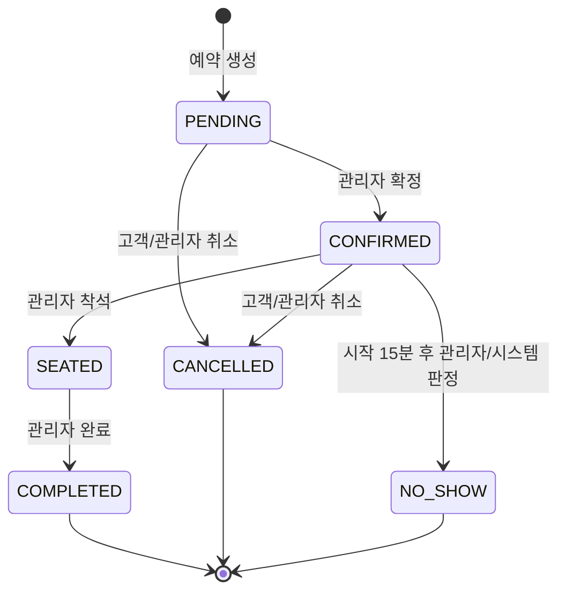

# TableFlow MVP 설계

> 상태: MVP M1~M11 구현 및 릴리스 리뷰 보완 기준선(v0.3)  
> 기준일: 2026-08-17  
> 범위: 단일 식당 브랜드의 복수 지점, 테이블 단독 배정, 관리자 승인형 예약

## 1. 문서 목적과 결정 원칙

이 문서는 TableFlow의 첫 구현 기준이다. 첫 MVP는 다음 한 흐름을 끝까지 안전하게 제공한다.

```text
예약 가능 시간 조회 → 예약 요청 및 테이블 배정 → 관리자 확정
→ 고객 조회·변경·취소 → 착석·완료 또는 노쇼 처리
```

핵심 원칙은 다음과 같다.

- 예약 가능 시간 조회 결과는 안내 정보다. 생성 트랜잭션에서 가용성을 다시 확인한다.
- 모든 영업 정책은 지점 시간대의 현지 시각으로 판단하고, DB에는 실제 시점을 UTC 기반 `timestamptz`로 저장한다.
- 예약 구간은 반열림 구간 `[시작, 종료)`을 사용한다. 정리 시간까지 포함한 점유 구간은 `[시작, 종료 + 정리 시간)`이다.
- 예약 상태는 서비스 계층의 한 전이 정책으로만 바꾼다.
- 애플리케이션의 잠금은 충돌을 줄이고, PostgreSQL 배타 제약은 잘못된 경로에서도 중복 예약을 최종 차단한다.
- 공개 예약 관리 권한은 추측하기 어려운 관리 토큰으로 확인한다. 전화번호만으로 예약을 노출하지 않는다.
- 기존 Todo는 예약 도메인과 공통 계약 테스트가 같은 검증 범위를 갖춘 뒤 M6에서 제거한다. 적용된 V1/V3 migration 이력은 그대로 보존한다.

## 2. MVP 요구사항 확정

### 2.1 사용자와 권한

- **고객**: 로그인 없이 지점과 예약 가능 시간을 보고 예약을 요청한다. 생성 시 받은 예약 번호와 관리 토큰으로 자신의 예약만 조회·변경·취소한다.
- **관리자**: 인증 후 식당·지점·테이블·영업시간·차단 시간을 관리하고, 예약 목록을 보며 상태를 전이한다.
- **시스템**: 가용성을 계산하고 테이블을 배정하며 중복을 막고 모든 상태 변경 이력을 기록한다.

로컬 Basic 계정은 개발용 관리자 한 명으로 취급한다. 운영 OIDC의 구체적인 issuer와 역할 claim 매핑은 배포 전 보안 마일스톤에서 확정한다. MVP API 경계는 `CUSTOMER`와 `ADMIN` 두 권한만 전제한다.

### 2.2 고객 기능

| ID | 요구사항 | 완료 조건 |
|---|---|---|
| C-01 | 예약 가능 시간 조회 | 지점, 날짜, 인원수로 조회하면 지점 현지 시각 기준 슬롯과 남은 테이블 수를 반환한다. |
| C-02 | 예약 생성 | 고객명, 휴대전화, 동의, 시작 시각, 인원수, 멱등성 키를 받아 한 테이블을 배정하고 `PENDING` 예약을 만든다. |
| C-03 | 예약 확인 | 예약 번호와 관리 토큰이 모두 맞을 때만 예약 상세를 반환한다. |
| C-04 | 예약 변경 | 허용 상태와 마감 시간 안에서 시작 시각 또는 인원수를 바꾸고 테이블을 원자적으로 재배정한다. |
| C-05 | 예약 취소 | 허용 상태와 마감 시간 안에서 고객이 취소하며 사유를 선택적으로 남긴다. |
| C-06 | 개인정보 동의 | 생성 시 필수 개인정보 수집 동의 시각과 정책 버전을 기록한다. 마케팅 동의는 MVP 범위에 넣지 않는다. |

### 2.3 관리자 기능

| ID | 요구사항 | 완료 조건 |
|---|---|---|
| A-01 | 식당·지점 설정 | 기본 정보와 지점 시간대 및 예약 정책 값을 조회·변경한다. |
| A-02 | 테이블 관리 | 지점별 테이블 이름, 수용 인원, 사용 여부를 관리한다. |
| A-03 | 영업시간 관리 | 요일별 복수 영업 구간을 관리한다. 자정을 넘는 한 구간은 MVP에서 허용하지 않는다. |
| A-04 | 차단 시간 관리 | 지점 전체 또는 특정 테이블의 임시 차단 구간과 사유를 관리한다. 종일 휴무도 차단 구간으로 표현한다. |
| A-05 | 예약 목록 | 지점과 현지 날짜, 상태로 필터링한 페이지 목록을 시작 시각 순으로 본다. |
| A-06 | 상태 처리 | 확정, 착석, 완료, 취소, 노쇼를 허용된 전이에서만 처리한다. |
| A-07 | 현황 조회 | 날짜별 상태 수와 시간대별 사용 가능 테이블 수를 확인한다. |
| A-08 | 운영자 예외 처리 | 고객 마감 시간을 지난 취소는 사유를 필수로 받아 수행할 수 있지만, 테이블 수용 인원 초과나 중복 예약은 허용하지 않는다. |

### 2.4 비기능 요구사항

- PostgreSQL이 같은 테이블의 겹치는 활성 예약을 하나만 허용해야 한다.
- 같은 요청의 네트워크 재시도는 같은 멱등성 키를 사용하면 예약을 하나만 만든다.
- 예약 생성 동시성 통합 테스트는 같은 마지막 테이블을 겨루는 요청 중 하나만 성공함을 검증한다.
- 모든 오류는 RFC 9457 Problem Details와 안정적인 `code`, `traceId`를 반환한다.
- 상태 변경은 `reservation_status_history`에 행위자, 이전/다음 상태, 사유, 시각을 남긴다.
- 관리 변경은 낙관적 잠금 버전으로 분실 업데이트를 막는다.
- 연락처 원문과 고객명은 애플리케이션 암호화 후 저장하고, 중복 판단용 전화번호 HMAC과 표시용 끝 네 자리만 별도로 저장한다.
- 로그에 고객명, 전화번호, 관리 토큰, 동의 원문을 남기지 않는다.

### 2.5 MVP 제외 범위

- 예약금·결제·환불
- SMS·이메일 실제 발송
- 고객 계정, 소셜 로그인, 고객별 장기 프로필
- 메뉴 사전 주문, 좌석 선호, 대기열
- 여러 테이블 조합과 자동 최적화
- 여러 독립 사업자를 격리하는 SaaS 멀티테넌시 및 과금
- 자정을 넘는 영업시간, 반복 휴일 규칙
- 관리자의 중복 예약 또는 정원 초과 강제 생성

## 3. 용어 사전

| 용어 | 영문/코드 | 정의 |
|---|---|---|
| 식당 | Restaurant | 하나의 브랜드·사업 운영 단위. MVP에는 하나만 두지만 지점과 분리한다. |
| 지점 | Branch | 주소, 시간대, 예약 정책과 영업시간을 갖는 실제 영업 장소. |
| 테이블 | DiningTable | 한 예약에 단독 배정되는 최소 좌석 자원. DB의 `table` 예약어와 구분하기 위해 이 이름을 쓴다. |
| 영업 구간 | BusinessHours | 특정 요일에 예약 시작이 가능한 현지 시각 범위. 하루에 복수 구간을 둘 수 있다. |
| 차단 시간 | BookingBlock | 휴무·행사·고장 등으로 지점 전체 또는 특정 테이블을 예약할 수 없는 실제 시각 범위. |
| 예약 | Reservation | 고객 연락처, 인원, 이용 구간, 배정 테이블, 상태를 묶은 애그리거트. |
| 이용 구간 | ServiceInterval | 고객이 테이블을 사용하는 `[startsAt, endsAt)` 구간. |
| 점유 구간 | OccupancyInterval | 이용 구간 뒤 정리 시간을 포함한 `[startsAt, occupiedUntil)` 구간. 중복 판단 기준이다. |
| 예약 슬롯 | AvailabilitySlot | 슬롯 간격에 맞춘 예약 시작 후보. 조회 결과일 뿐 좌석을 보장하지 않는다. |
| 예약 번호 | ReservationCode | 고객에게 보여 주는 10자리 비순차 식별자. 단독으로는 조회 권한이 아니다. |
| 관리 토큰 | ManageToken | 서버 비밀키와 멱등성 키에서 HMAC으로 파생하는 256비트 의사난수 비밀값. 최초 생성과 동일 요청 재시도에 전달하며 서버에는 검증 해시만 저장한다. |
| 활성 예약 | CapacityHoldingReservation | `PENDING`, `CONFIRMED`, `SEATED` 중 하나로 좌석을 점유하는 예약. |
| 멱등성 키 | IdempotencyKey | 같은 생성 의도를 재시도했는지 식별하는 요청별 UUID. |
| 연락처 지문 | ContactPhoneHash | 정규화한 전화번호를 서버 비밀키로 HMAC 처리한 값. 원문 복구나 로그 출력에 쓰지 않는다. |

MVP에서는 별도 `Customer` 엔터티를 두지 않는다. 로그인 없는 연락처를 고객 프로필로 합치면 가족 공용 번호나 번호 변경을 잘못 병합할 수 있기 때문이다. 고객 정보는 예약 시점의 암호화된 연락처 스냅샷으로 보관한다. 고객 계정이 도입될 때 별도 엔터티로 승격한다.

## 4. 예약 정책

### 4.1 지점 정책 기본값

| 정책 | 기본값 | 규칙 |
|---|---:|---|
| 시간대 | `Asia/Seoul` | IANA timezone ID만 허용한다. |
| 슬롯 간격 | 30분 | 시작 시각은 현지 자정부터 이 간격의 배수여야 한다. |
| 기본 이용 시간 | 90분 | 첫 MVP에서는 모든 예약에 동일하게 적용한다. |
| 정리 시간 | 15분 | 이용 종료 뒤 좌석 점유에 포함한다. |
| 최소 사전 예약 | 60분 | 현재 시각보다 최소 이 시간 이후의 슬롯만 생성할 수 있다. |
| 예약 가능 기간 | 30일 | 지점 현지 오늘부터 30일 뒤까지 포함한다. |
| 변경·취소 마감 | 시작 3시간 전 | 고객 변경·취소에 적용한다. 관리자는 사유를 남기고 취소만 예외 처리할 수 있다. |
| 노쇼 판정 유예 | 시작 15분 후 | 이 시각이 지난 `CONFIRMED`만 `NO_SHOW`로 바꿀 수 있다. |
| 최대 인원 | 8명 | 1명 이상이어야 하며 지점 최대 인원을 넘을 수 없다. |
| 허용 빈 좌석 | 최대 2석 | `capacity >= partySize`이면서 차이가 2 이하인 가장 작은 테이블을 우선한다. |

정책 값은 `branches`에 저장하며 변경은 새 예약과 이후 변경 계산에 적용한다. 이미 생성된 예약의 `ends_at`과 `occupied_until`은 소급 변경하지 않는다.

### 4.2 영업시간과 슬롯 판정

한 슬롯은 다음 조건을 모두 만족할 때만 노출한다.

1. 요청 날짜가 지점 현지 오늘부터 예약 가능 기간 안이다.
2. 시작 시각이 슬롯 간격에 맞고 최소 사전 예약 이후다.
3. `[startsAt, endsAt)` 전체가 같은 영업 구간 안에 있다. 정리 시간은 영업 종료 뒤로 넘어갈 수 있다.
4. 지점 전체 차단과 겹치지 않는다.
5. 인원을 수용할 수 있는 활성 테이블 중 테이블 차단 또는 활성 예약의 점유 구간과 겹치지 않는 테이블이 하나 이상 있다.

예약 가능 시간 조회 응답은 계산 기준 시각 `asOf`와 `availableTableCount`를 포함한다. 생성 시점까지 다른 요청이 먼저 좌석을 가져갈 수 있으므로 이를 예약 보장으로 표현하지 않는다.

### 4.3 테이블 배정

- 후보는 `사용 가능`, `수용 인원 >= 예약 인원`, `수용 인원 - 예약 인원 <= 2`인 테이블이다.
- 수용 인원 오름차순, 테이블 이름 오름차순으로 결정적으로 선택한다.
- 적합한 테이블이 없으면 `409 NO_TABLE_AVAILABLE`을 반환한다.
- 관리자를 포함해 수용 인원을 넘겨 배정할 수 없다.
- 여러 테이블을 합치는 기능은 제외한다.

### 4.4 동일 고객 중복

같은 지점에서 동일한 연락처 지문을 가진 활성 예약의 **이용 구간**이 겹치면 생성과 변경을 거부한다. 정리 시간은 고객 중복 판정에는 포함하지 않는다. 다른 지점 또는 겹치지 않는 시간의 예약은 허용한다. 취소·완료·노쇼 예약은 새 예약을 막지 않는다.

### 4.5 변경·취소

- 고객 변경은 `PENDING` 또는 `CONFIRMED`이고 시작 3시간 전까지 가능하다.
- 시작 시각 또는 인원 변경은 기존 테이블을 포함해 전체 후보를 다시 평가한다. 새 배정과 기존 배정 해제는 한 트랜잭션에서 처리한다.
- 고객 취소는 `PENDING` 또는 `CONFIRMED`이고 시작 3시간 전까지 가능하다.
- 관리자는 `PENDING` 또는 `CONFIRMED`를 언제든 취소할 수 있으나 마감 이후에는 사유가 필수다.
- 착석 뒤에는 취소하지 않고 `COMPLETED`로 끝낸다. 입력 실수 정정 기능은 감사 정책과 함께 후속 범위에서 설계한다.

### 4.6 멱등성

- 공개 예약 생성은 `Idempotency-Key` UUID 헤더를 필수로 받는다.
- 서버는 멱등성 키와 요청 본문 지문을 함께 보관한다.
- 같은 키와 같은 본문이면 최초 생성 응답을 재현한다.
- 같은 키와 다른 본문이면 `409 IDEMPOTENCY_KEY_REUSED`를 반환한다.
- 같은 키의 동시 요청은 PostgreSQL transaction advisory lock으로 직렬화한다. 키가 다른 예약의 테이블 잠금과는 독립적이다.
- 멱등성 처리는 예약 중복 제약을 대체하지 않는다. 두 장치는 서로 다른 실패 형태를 막는다.

## 5. 상태와 전이

### 5.1 상태 정의

| 상태 | 의미 | 좌석 점유 |
|---|---|---|
| `PENDING` | 테이블이 배정되었고 관리자 확인을 기다리는 예약 요청 | 예 |
| `CONFIRMED` | 지점이 방문을 확정한 예약 | 예 |
| `SEATED` | 고객이 도착해 착석한 예약 | 예 |
| `COMPLETED` | 식사가 정상 완료된 예약. 기록된 정리 종료 시각까지 DB 점유 제약은 유지한다. | `occupiedUntil`까지 |
| `CANCELLED` | 고객 또는 관리자가 취소한 예약 | 아니요 |
| `NO_SHOW` | 확정 고객이 유예 시각까지 방문하지 않은 예약 | 아니요 |



### 5.2 전이 규칙

| 현재 | 다음 | 행위자 | 추가 조건 |
|---|---|---|---|
| `PENDING` | `CONFIRMED` | 관리자 | 시작 전이며 현재 버전이 일치해야 한다. |
| `PENDING` | `CANCELLED` | 고객/관리자 | 고객은 취소 마감 전, 관리자는 마감 후 사유 필수. |
| `CONFIRMED` | `SEATED` | 관리자 | 지점 현지 예약일 당일이며 현재 버전이 일치해야 한다. |
| `CONFIRMED` | `CANCELLED` | 고객/관리자 | 고객은 취소 마감 전, 관리자는 마감 후 사유 필수. |
| `CONFIRMED` | `NO_SHOW` | 관리자/시스템 | `startsAt + noShowGraceMinutes` 이후. |
| `SEATED` | `COMPLETED` | 관리자 | 이용 종료 시각 이후이며 현재 버전이 일치해야 한다. |

모든 다른 전이는 `409 INVALID_RESERVATION_TRANSITION`이다. 같은 목표 상태를 다시 보내는 관리자 전이 요청은 멱등하게 현재 예약을 반환하되 이력을 중복 기록하지 않는다.

## 6. 데이터 모델과 ERD

```mermaid
erDiagram
    RESTAURANT ||--o{ BRANCH : operates
    BRANCH ||--o{ DINING_TABLE : has
    BRANCH ||--o{ BUSINESS_HOURS : schedules
    BRANCH ||--o{ BOOKING_BLOCK : blocks
    DINING_TABLE o|--o{ BOOKING_BLOCK : optionally_blocks
    BRANCH ||--o{ RESERVATION : receives
    DINING_TABLE ||--o{ RESERVATION : assigned_to
    RESERVATION ||--o{ RESERVATION_STATUS_HISTORY : records

    RESTAURANT {
        uuid id PK
        varchar name
        varchar status
        timestamptz created_at
        timestamptz updated_at
    }
    BRANCH {
        uuid id PK
        uuid restaurant_id FK
        varchar name
        varchar timezone
        int slot_interval_minutes
        int default_duration_minutes
        int buffer_minutes
        int min_advance_minutes
        int booking_horizon_days
        int change_cutoff_minutes
        int no_show_grace_minutes
        int max_party_size
        int max_capacity_gap
        bigint version
    }
    DINING_TABLE {
        uuid id PK
        uuid branch_id FK
        varchar name
        int capacity
        boolean enabled
        bigint version
    }
    BUSINESS_HOURS {
        uuid id PK
        uuid branch_id FK
        smallint day_of_week
        time opens_at
        time closes_at
    }
    BOOKING_BLOCK {
        uuid id PK
        uuid branch_id FK
        uuid dining_table_id FK_NULL
        timestamptz starts_at
        timestamptz ends_at
        varchar reason
    }
    RESERVATION {
        uuid id PK
        uuid branch_id FK
        uuid dining_table_id FK
        varchar reservation_code UK
        varchar manage_token_hash
        uuid idempotency_key UK
        varchar request_fingerprint
        text guest_name_ciphertext
        text guest_phone_ciphertext
        varchar contact_phone_hash
        varchar phone_last_four
        int party_size
        timestamptz starts_at
        timestamptz ends_at
        timestamptz occupied_until
        varchar status
        varchar privacy_policy_version
        timestamptz privacy_agreed_at
        bigint version
    }
    RESERVATION_STATUS_HISTORY {
        uuid id PK
        uuid reservation_id FK
        varchar from_status
        varchar to_status
        varchar actor_type
        varchar actor_id
        varchar reason
        timestamptz changed_at
    }
```

### 6.1 주요 제약과 인덱스

- `dining_tables`: `(branch_id, name)` unique, `capacity > 0`.
- `business_hours`: `day_of_week between 1 and 7`, `opens_at < closes_at`, `(branch_id, day_of_week, opens_at)` unique.
- `booking_blocks`: `starts_at < ends_at`; 테이블을 지정했다면 그 테이블이 같은 지점 소속인지 서비스에서 확인한다.
- `reservations`: `starts_at < ends_at <= occupied_until`, `party_size > 0`, 예약 번호와 멱등성 키 unique.
- 예약 목록: `(branch_id, starts_at, status)` B-tree 인덱스.
- 공개 조회: `reservation_code` unique 인덱스. 토큰 해시는 단독 조회 키로 사용하지 않는다.
- 시간 겹침: PostgreSQL `btree_gist`와 부분 exclusion constraint를 사용한다.

```sql
exclude using gist (
  dining_table_id with =,
  tstzrange(starts_at, occupied_until, '[)') with &&
)
where (status in ('PENDING', 'CONFIRMED', 'SEATED', 'COMPLETED'))
```

동일 고객 중복도 같은 방식으로 `(branch_id, contact_phone_hash, tstzrange(starts_at, ends_at, '[)'))`에 좌석 점유 상태 부분 exclusion constraint를 둔다. `COMPLETED`는 이용 종료 뒤에만 전이할 수 있고 기록된 정리 시간까지 제약에 남는다. `btree_gist` 확장은 migration 실행 계정에 설치 권한이 있어야 하며, 운영 환경에서는 배포 전 DBA가 확장을 선설치할 수 있다.

## 7. 동시성 및 중복 예약 방지 전략

### 7.1 예약 생성 트랜잭션

1. `Idempotency-Key`의 transaction advisory lock을 얻고 요청 지문을 확인한다. 같은 성공 요청이면 HMAC으로 같은 관리 토큰을 재생성해 기존 결과를 반환한다.
2. 지점 정책, 영업시간, 차단 시간을 확인한다.
3. 후보 테이블을 수용 인원·이름 순으로 조회하고 해당 행을 `PESSIMISTIC_WRITE`로 잠근다. 모든 코드 경로가 같은 순서를 사용한다.
4. 잠금 안에서 활성 예약과 테이블 차단 겹침을 다시 조회한다.
5. 첫 가용 테이블을 배정해 예약과 최초 상태 이력을 저장한다.
6. flush 시 DB exclusion constraint가 마지막으로 겹침을 검증한다.
7. 커밋 뒤 예약 번호와 관리 토큰을 반환한다. 관리 토큰 원문은 DB에서 다시 조회하지 않으며 동일 멱등 재시도에서만 재생성할 수 있다.

테이블 행 잠금은 정상 경로의 충돌을 직렬화해 사용자에게 안정적인 오류를 주고, exclusion constraint는 누락된 애플리케이션 검사나 다른 쓰기 경로를 방어한다. 예약 가능 시간 조회에는 잠금을 걸지 않는다.

### 7.2 변경과 상태 전이

- 시간·인원 변경은 현재 예약과 후보 테이블을 결정적 순서로 잠근 뒤 재검증한다.
- 취소는 예약 상태를 먼저 `CANCELLED`로 바꾸며 같은 트랜잭션에서 이력을 남긴다. 부분 exclusion constraint에서 즉시 빠진다.
- 관리자 상태 전이는 요청의 `expectedVersion`과 JPA `@Version`을 사용한다. 충돌하면 `409 RESERVATION_VERSION_CONFLICT`와 최신 조회 안내를 반환한다.
- 차단 시간 생성도 대상 테이블 행을 잠그고 겹치는 활성 예약을 확인한다. 지점 전체 차단은 지점의 모든 활성 테이블을 같은 정렬 순서로 잠근다.

### 7.3 경합 오류 매핑

DB 제약 이름을 안정적인 오류 코드로 매핑한다.

- `ex_reservation_table_occupancy` → `409 RESERVATION_CONFLICT`
- `ex_reservation_customer_overlap` → `409 DUPLICATE_CUSTOMER_RESERVATION`
- `uk_reservation_idempotency_key` → 기존 응답 재조회 또는 `409 IDEMPOTENCY_KEY_REUSED`
- 낙관적 잠금 실패 → `409 RESERVATION_VERSION_CONFLICT`

제약 위반 원문, SQL, 고객 정보는 API와 로그 메시지에 노출하지 않는다.

### 7.4 반드시 필요한 통합 테스트

- 동일 테이블·겹치는 구간을 동시에 생성하면 하나만 성공한다.
- 종료 시각과 다음 시작 시각이 같으면 둘 다 성공한다.
- 정리 시간과 다음 예약이 겹치면 하나가 거부된다.
- 같은 고객·같은 지점·겹치는 이용 구간은 다른 테이블이 있어도 거부된다.
- 동일 멱등성 키·동일 요청 재시도는 같은 예약을 반환한다.
- 동일 멱등성 키·다른 요청은 거부된다.
- 취소와 새 예약이 경합해도 최종적으로 활성 중복이 없다.
- 변경 경합에서 한 요청만 버전 검증을 통과한다.

## 8. API 계약 초안

실행 가능한 상세 계약은 `openapi/openapi.yaml`에서 관리한다. 경로 구분은 다음과 같다.

### 8.1 공개 고객 API

| Method | Path | 용도 | 인증/보호 |
|---|---|---|---|
| `GET` | `/api/public/booking-context` | 활성 예약 지점·개인정보 정책 기준 조회 | 공개 |
| `GET` | `/api/public/branches/{branchId}/availability` | 날짜·인원별 슬롯 조회 | 공개 |
| `POST` | `/api/public/reservations` | 예약 요청 생성 | 공개, `Idempotency-Key` 필수 |
| `GET` | `/api/public/reservations/{reservationCode}` | 예약 상세 조회 | `X-Reservation-Token` 필수 |
| `PATCH` | `/api/public/reservations/{reservationCode}` | 예약 시간·인원 변경 | `X-Reservation-Token` 필수 |
| `POST` | `/api/public/reservations/{reservationCode}/cancellation` | 예약 취소 | `X-Reservation-Token` 필수 |

### 8.2 관리자 API

| Method | Path | 용도 |
|---|---|---|
| `GET` | `/api/admin/branches/{branchId}/reservations` | 날짜·상태별 예약 목록 |
| `GET` | `/api/admin/branches/{branchId}/reservation-dashboard` | 상태 건수·시간대별 테이블 현황 |
| `GET` | `/api/admin/reservations/{reservationId}` | 예약 상세·상태 이력 |
| `POST` | `/api/admin/reservations/{reservationId}/transitions` | 확정·착석·완료·취소·노쇼 처리 |
| `GET/POST` | `/api/admin/restaurants` | 식당 목록 조회·생성 |
| `GET/PATCH` | `/api/admin/restaurants/{restaurantId}` | 식당 정보 조회·변경 |
| `GET/POST` | `/api/admin/restaurants/{restaurantId}/branches` | 지점 목록 조회·생성 |
| `GET/PATCH` | `/api/admin/branches/{branchId}` | 지점·예약 정책 조회·변경 |
| `GET/POST` | `/api/admin/branches/{branchId}/tables` | 테이블 조회·생성 |
| `PATCH` | `/api/admin/tables/{tableId}` | 테이블 변경 |
| `GET/PUT` | `/api/admin/branches/{branchId}/business-hours` | 주간 영업시간 조회·교체 |
| `GET/POST` | `/api/admin/branches/{branchId}/booking-blocks` | 차단 시간 조회·생성 |
| `DELETE` | `/api/admin/booking-blocks/{bookingBlockId}` | 차단 시간 삭제 |

현재 OpenAPI는 공개 예약 접수·관리, 관리자 설정·당일 운영, 인증과 공통 오류 계약을 모두 포함한다. Todo 경로는 예약 도메인 계약 테스트가 검증 책임을 대체한 뒤 V6 migration과 함께 제거했다.

### 8.3 공통 오류 코드

| HTTP | 코드 | 의미 |
|---:|---|---|
| 400 | `VALIDATION_ERROR` | 형식·범위 검증 실패 |
| 400 | `INVALID_LOCAL_TIME` | DST 등으로 지점 시간대에 존재하지 않거나 모호한 현지 시각 |
| 401 | `AUTHENTICATION_REQUIRED` | 관리자 인증 누락/실패 |
| 403 | `ACCESS_DENIED` | 관리자 권한 부족 |
| 403 | `INVALID_RESERVATION_TOKEN` | 예약 관리 토큰 불일치 |
| 404 | `BRANCH_NOT_FOUND`, `RESERVATION_NOT_FOUND` | 대상 없음 |
| 409 | `NO_TABLE_AVAILABLE` | 조건에 맞는 가용 테이블 없음 |
| 409 | `RESERVATION_CONFLICT` | 테이블 점유 구간 경합 |
| 409 | `DUPLICATE_CUSTOMER_RESERVATION` | 같은 고객의 겹치는 활성 예약 |
| 409 | `INVALID_RESERVATION_TRANSITION` | 허용되지 않은 상태 전이 |
| 409 | `RESERVATION_VERSION_CONFLICT` | 고객·관리자 동시 수정 충돌 |
| 409 | `IDEMPOTENCY_KEY_REUSED` | 같은 키를 다른 본문에 재사용 |
| 422 | `OUTSIDE_BUSINESS_HOURS` | 영업 구간 밖의 예약 |
| 422 | `BOOKING_POLICY_VIOLATION` | 사전 예약·기간·마감 정책 위반 |
| 422 | `RESERVATION_CHANGE_CUTOFF_PASSED` | 고객 예약 변경 마감 경과 |
| 422 | `RESERVATION_CHANGE_NOT_ALLOWED` | 현재 상태에서 고객 변경 불가 |
| 422 | `RESERVATION_CANCELLATION_NOT_ALLOWED` | 현재 상태 또는 마감 정책상 고객 취소 불가 |

존재 여부 추측을 막기 위해 공개 예약 조회에서 예약 번호가 없거나 토큰이 틀린 경우 외부 detail은 동일하게 처리한다. 내부 로그는 개인정보 없이 원인을 구분한다.

## 9. 구현 마일스톤

### M0. 설계와 계약

- 이 문서와 OpenAPI 핵심 초안을 검토한다.
- 시간, 상태, 개인정보, 동시성 결정이 서로 모순되지 않는지 확인한다.
- Todo 교체 게이트를 확정한다.

완료 기준: 문서 리뷰 체크리스트 통과, OpenAPI 타입 생성 성공.

### M1. 핵심 스키마와 도메인 규칙 (완료)

- 기존 migration을 수정하지 않고 `V4`부터 식당·지점·테이블·영업시간·차단·예약·이력을 추가한다.
- 예약 상태 enum과 단일 전이 정책을 구현한다.
- 지점 정책 기본값과 DB 제약을 구현한다.
- Flyway/Testcontainers 스키마 검증과 상태 전이 단위 테스트를 추가한다.

완료 기준: migration 성공, JPA validation 성공, 상태 전이 테스트 성공, 기존 Todo 테스트 유지.

### M2. 설정 관리와 예약 가능 시간 (완료)

- 식당·지점·테이블·영업시간·차단 시간 관리자 기능을 구현한다.
- 고정 Clock을 주입할 수 있는 가용성 계산기를 구현한다.
- 공개 슬롯 조회 API와 테스트를 구현한다.

완료 기준: 영업 경계·차단·정리 시간·기간 정책 테스트와 OpenAPI 일치.

### M3. 예약 생성과 동시성 (완료)

- 개인정보 암호화/HMAC, 예약 번호·토큰 발급, 멱등성 처리를 구현한다.
- 테이블 잠금과 exclusion constraint 오류 매핑을 구현한다.
- 공개 생성 API와 병렬 통합 테스트를 구현한다.

완료 기준: 마지막 좌석 경합, 고객 중복, 멱등 재시도 테스트 통과.

### M4. 고객 셀프서비스 (완료)

- 토큰 기반 예약 조회·변경·취소를 구현한다.
- 변경 시 원자적 재배정과 취소 마감을 구현한다.
- 고객 예약 조회·변경·취소 UI를 구현한다.

완료 기준: 토큰 누출 없는 오류, 정책 경계 테스트, 접근성 기본 점검.

### M5. 관리자 운영 (완료)

- 날짜별 목록·현황, 상태 전이, 상태 이력을 구현한다.
- 낙관적 잠금과 노쇼 유예 규칙을 구현한다.
- 관리자 당일 운영 UI를 구현한다.

완료 기준: 모든 상태 전이·버전 충돌·페이지 계약 테스트 통과.

### M6. 운영 준비와 Todo 제거 (완료)

- OIDC 역할 매핑, rate limit, 개인정보 키 회전·보존/파기, 백업·복구를 확정한다.
- 예약 도메인 회귀 테스트가 공통 계약을 모두 대체했는지 확인한다.
- Todo 코드·화면·OpenAPI를 제거하고 **새 migration**으로 `todos` 테이블을 제거한다.

완료 기준: 전체 검증, 컨테이너 smoke test, 운영 체크리스트 통과.

### M7. 고객 예약 접수 화면 (완료)

- 활성 식당·지점과 현재 개인정보 정책 기준을 제공하는 공개 booking context API를 구현한다.
- 지점·날짜·인원별 가용성 조회와 시간 선택, 예약자 정보·필수 동의를 하나의 고객 흐름으로 연결한다.
- 동일 요청 재시도에 같은 멱등성 키를 쓰고 입력이 바뀌면 새 키를 발급한다.
- 생성 직후 예약 번호와 관리 토큰을 한 번만 표시하고 복사 기능을 제공하되 URL과 브라우저 저장소에는 남기지 않는다.
- 정책 버전 불일치와 좌석 경합 시 최신 정책·가용성을 다시 조회하도록 한다.

완료 기준: 예약 성공·빈 슬롯·동일 요청 재시도·자격정보 비저장 화면 테스트와 OpenAPI 타입 검증 통과.

### M8. 스테이징 인수 자동화 (완료)

- 배포된 프런트와 백엔드 health, SPA 딥링크와 필수 보안 헤더를 읽기 전용으로 확인한다.
- 공개 booking context의 정책·지점 계약과 `X-Request-Id` 전파를 확인한다.
- 공개 health 외 `/actuator/**`를 Nginx에서 명시적으로 404 처리하고 Prometheus 지표가 외부로 노출되지 않는지 확인한다.
- 원격 HTTP를 기본 거부하고 실제 고객 정보나 예약 데이터를 만들지 않는 smoke CLI를 제공한다.
- 실제 OIDC 왕복, 역할 분리와 예약 생성·관리·취소는 승인된 테스트 계정·연락처를 사용하는 수동 인수 시나리오로 분리한다.

완료 기준: smoke 계약 테스트, 전체 품질 게이트, 운영 이미지 빌드와 Nginx 런타임 검증 통과.

### M9. 관리자 매장 설정 화면 (완료)

- Basic/OIDC 관리자 인증을 예약 운영과 매장 설정 화면이 공유하는 메모리 세션으로 통합한다.
- 식당·지점 생성과 운영 상태, 지점 예약 정책 전체를 화면에서 관리한다.
- 테이블 생성과 이름·수용 인원·예약 사용 여부 변경에 낙관적 버전을 사용한다.
- 하루 복수 구간을 지원하는 주간 영업시간 전체 교체 편집기를 제공한다.
- 지점 전체 또는 테이블별 예약 차단을 지점 현지 시각으로 입력하고 삭제는 2단계로 확인한다.
- 설정 변경 뒤 공개 booking context와 가용성 캐시를 무효화하고 버전 충돌 시 최신 관리자 데이터를 다시 조회한다.

완료 기준: 공유 인증 비저장, 정책 버전 전송, 영업시간 정규화, 현지 시각 변환, 차단 삭제 확인 UI 테스트와 전체 검증 통과.

### M10. 스테이징 배포 사전검증 (완료)

- 운영 환경 파일에서 필수값, 예제값과 추적 가능한 애플리케이션 버전을 검증한다.
- 서비스·CORS origin과 OIDC issuer·CSP origin의 HTTPS 경계를 검증한다.
- 예약 AES/HMAC 키의 표준 Base64 32바이트 형식, 키 분리, 키 ID와 rotation 조건을 검증한다.
- 보존 기간, batch, rate limit, cron과 포트의 안전한 입력 범위를 검증한다.
- 선택적 온라인 검사로 OIDC discovery issuer, HTTPS endpoint와 PKCE S256 지원을 확인한다.
- 비밀값을 출력하지 않는 CLI, 자동 테스트와 수동 UAT 기록 양식을 제공한다.

완료 기준: 유효 구성·예제값 차단·origin/key/rotation 오류·OIDC metadata 변조 테스트, CI와 전체 품질 게이트 통과.

### M11. 스테이징 쓰기 UAT 자동화 (완료)

- `--confirm-write`와 승인된 테스트 환경값 없이는 네트워크 요청을 시작하지 않는다.
- 관리자 API의 무인증 401, 선택적 비관리자 403과 관리자 200을 예약 생성 전에 검증한다.
- 공개 지점 정책의 취소 마감보다 먼 가용 슬롯만 선택해 합성 고객 예약을 생성한다.
- 같은 idempotency key와 본문의 재요청이 같은 예약과 관리 token을 반환하는지 확인한다.
- 고객 관리 token 조회, 취소와 취소 상태 재조회를 한 실행에서 검증한다.
- 중간 실패 시 고객 취소를 시도하고 생성 응답을 읽지 못한 경우 고유 run 표식과 관리자 전이로 보조 정리한다.
- 결과와 오류에서 access token, 전화번호, 관리 token과 전체 예약 번호를 제외한다.

완료 기준: 명시적 승인 차단·정상 lifecycle·권한 사전 실패·관리자 보조 정리·정리 실패 정보 비노출 테스트와 전체 검증 통과.

## 10. Todo 교체 계획

Todo는 다음 대응 항목을 모두 준비한 뒤 단계적으로 교체했으며, 각 제거 게이트는 `CommonApiContractTests`와 예약 도메인 회귀 테스트에서 통과했다.

| Todo 검증 책임 | 대체 대상 | 제거 게이트 |
|---|---|---|
| 공개 GET·페이징 | 관리자 예약 목록/공개 가용성 테스트 | 페이지 메타데이터와 빈 결과 테스트 통과 |
| 인증된 POST | 관리자 설정 쓰기 테스트 | Basic/OIDC 인증 실패·성공 테스트 통과 |
| Bean Validation | 예약 생성/설정 요청 테스트 | 필드별 `VALIDATION_ERROR` 테스트 통과 |
| 도메인 404 | 지점/예약 조회 테스트 | 안정적인 not-found 코드 테스트 통과 |
| 공통 오류·malformed JSON | 공통 Web 계약 테스트 | Todo와 무관한 전용 테스트로 분리 완료 |
| 요청 ID·CORS·Actuator | 공통 인프라 통합 테스트 | 별도 `CommonApiContractTests`로 이동 완료 |
| OpenAPI 타입 생성 | 예약 API 생성 타입 | 프런트 `openapi:check` 통과 |
| TanStack Query·오류 UI | 예약 가능 시간/예약 조회 화면 | 로딩·성공·Problem Details 테스트 통과 |

제거는 `TodoPage`와 라우트 → Todo 프런트 API/types → Todo Controller/Entity/Repository → Todo OpenAPI 순으로 수행했고, 마지막에 새 `V6__drop_transitional_todos.sql`로 `todos` 테이블을 삭제했다. 이미 적용될 수 있는 기존 `V1`과 `V3`는 수정하거나 삭제하지 않았다.

## 11. 설계 검토 결과

### 11.1 검토 체크리스트

- [x] 인원보다 작은 테이블을 선택하거나 여러 테이블을 조합하지 않는다.
- [x] 가용성 조회와 예약 생성 사이 경쟁 조건을 생성 트랜잭션에서 다시 검증한다.
- [x] 종료와 다음 시작이 같은 반열림 구간은 허용하되 정리 시간은 점유에 포함한다.
- [x] `PENDING`도 좌석을 점유하므로 관리자 승인 대기 중 중복 배정되지 않는다.
- [x] 상태를 취소하면 DB 부분 exclusion constraint에서 빠져 좌석이 다시 열린다.
- [x] 고객 중복과 테이블 중복은 서로 다른 제약으로 방어한다.
- [x] 관리 토큰 원문과 개인정보 원문을 DB 및 로그에 평문 저장하지 않는다.
- [x] 정책 변경이 기존 예약 종료 시각을 소급 변경하지 않는다.
- [x] Todo 제거가 기존 migration 불변성과 공통 테스트를 깨뜨리지 않는다.
- [x] 첫 구현 범위가 결제·알림·테이블 조합으로 확장되지 않는다.

### 11.2 검토에서 보완한 사항

- 시작 안내의 `customer` 후보는 익명 연락처 오병합 위험 때문에 예약 스냅샷으로 변경했다.
- 가용성의 조회-생성 간 시차를 명시하고 DB exclusion constraint를 최종 안전장치로 추가했다.
- 테이블 중복뿐 아니라 같은 고객의 겹치는 활성 예약도 DB 수준에서 차단하도록 했다.
- 고객 조회를 예약 번호+전화번호 방식 대신 예약 번호+무작위 관리 토큰 방식으로 정해 열거 공격과 개인정보 노출을 줄였다.
- 정책 변경 시 기존 예약의 점유 구간을 보존하도록 스냅샷 필드를 명시했다.
- 관리자 예외 권한은 취소 마감에만 허용하고, 중복과 수용 인원 초과에는 허용하지 않도록 제한했다.

### 11.3 운영에서 계속 관리할 결정

다음 항목은 구현 기본값이 있으나 운영 배포 전 실제 사업 정책과 인프라에 맞춰 승인해야 한다.

- 개인정보 보존 기본값 365일과 파기 batch 일정을 법무·개인정보 책임자가 승인한다.
- OIDC issuer·audience·role claim과 관리자 역할을 실제 IdP에 맞추고, 지점별 권한은 후속 범위에서 설계한다.
- 생성 10회/분, 관리 30회/분의 인스턴스별 rate limit을 부하 시험 후 조정하고 엣지 전역 제한과 경보를 연결한다.
- AES 현재·이전 키 재암호화 batch와 백업·복구 절차는 운영 런북에 따라 정기 훈련한다.
- 관리자 승인 SLA 및 오래된 `PENDING` 예약 처리 정책
- SMS 연동 시 발신 실패와 예약 상태의 독립성

## 12. 구현 진행 기록

### 2026-08-16 · M1

- `V4__create_tableflow_core.sql`에 핵심 테이블, 복합 외래 키, 예약 배타 제약을 추가했다.
- JPA 핵심 모델과 예약 상태 전이 정책을 구현했다.
- Testcontainers에서 정리 시간, 반열림 구간, 동일 고객 중복 제약을 검증했다.

### 2026-08-16 · M2

- 식당·지점 목록/생성/조회/수정과 테이블 목록/생성/수정 API를 구현했다.
- 주간 영업시간 전체 교체와 차단 시간 조회/생성/삭제 API를 구현했다.
- 관리자 경로는 GET을 포함한 모든 요청에 인증을 요구하도록 보안 경계를 수정했다.
- 주입 가능한 UTC Clock과 지점 시간대 기반 슬롯 계산기를 구현했다.
- 지점 정책, 테이블 수용 인원, 영업시간, 최소 사전 예약, 차단 시간, 기존 예약 점유를 가용성에 반영했다.
- 고정 시각 통합 테스트와 OpenAPI 생성 타입 검증을 추가했다.

### 2026-08-16 · M3

- AES-256-GCM 예약 개인정보 암호화와 전화번호·요청·관리 토큰의 도메인 분리 HMAC을 구현했다.
- 국내 휴대전화 번호를 E.164 형태로 정규화하고 원문 대신 암호문, HMAC, 끝 네 자리만 저장하도록 했다.
- 공개 예약 생성 API에서 지점 정책과 영업시간을 다시 검증하고 지점·테이블 잠금 뒤 가장 작은 적합 테이블을 배정하도록 했다.
- 같은 멱등성 키를 transaction advisory lock으로 직렬화하고 같은 본문에는 예약 번호와 관리 토큰을 동일하게 재현하도록 했다.
- 같은 고객의 겹치는 예약을 사전 검사와 DB exclusion constraint로 이중 방어했다.
- 마지막 한 테이블 경합과 같은 키의 동시 재시도를 병렬 통합 테스트로 검증했다.
- 운영 프로필에는 서로 다른 32바이트 Base64 암호화/HMAC 키를 필수 환경 변수로 요구한다.

가용성 응답은 예약을 보장하지 않으며 실제 생성에서 같은 정책과 DB 제약으로 다시 검증한다.

### 2026-08-16 · M4

- 예약 번호와 관리 토큰으로 고객 예약을 조회하며, 번호 부재와 토큰 불일치는 같은 `404 RESERVATION_NOT_FOUND` 응답으로 처리한다.
- 변경과 취소 요청에 `expectedVersion`을 요구해 오래된 화면의 쓰기를 차단한다.
- 생성과 변경이 같은 배정 서비스를 사용하도록 영업시간·지점 정책·예약 블록·테이블 잠금·최소 적합 테이블 규칙을 공통화했다.
- 변경 시 현재 예약만 점유 및 고객 중복 검사에서 제외하고, 지점과 테이블을 잠근 트랜잭션 안에서 새 테이블을 원자적으로 배정한다.
- 고객 변경·취소 마감과 허용 상태를 검증하며 취소 시 상태 이력을 남기고 DB 배타 제약에서 좌석이 즉시 해제되도록 했다.
- 관리 토큰을 URL·브라우저 저장소·TanStack Query 키에 남기지 않는 고객 예약 관리 화면과 취소 2단계 확인을 구현했다.
- 토큰 비열거, 재배정, 마감, 버전 충돌, 취소 후 재예약, 동시 변경 단일 승자를 백엔드 통합 테스트로 검증했다.

### 2026-08-16 · M5

- 지점 현지 날짜와 상태로 필터링하는 시작 시각 순 관리자 예약 페이지 API를 구현했다.
- 관리자 상세와 목록은 고객명을 애플리케이션에서 복호화하되 전화번호는 끝 네 자리만 노출하고 상태 이력을 함께 반환한다.
- 날짜별 여섯 상태 건수와 영업시간 슬롯별 사용 가능·점유·차단 테이블 수를 제공하는 운영 현황 API를 추가했다.
- 관리자 상태 전이는 예약 행 잠금과 `expectedVersion` 검증 뒤 단일 상태 전이 정책을 사용하며, 행위자 ID·사유·시각을 이력에 기록한다.
- 확정, 착석, 완료, 취소, 노쇼 규칙과 관리자 마감 후 취소 사유, 동일 상태 멱등 재시도를 구현했다.
- 같은 버전의 동시 상태 전이에서 한 요청만 상태를 변경하도록 병렬 통합 테스트로 검증했다.
- 로컬 Basic 인증을 화면 메모리에만 보관하는 당일 운영 보드에서 식당·지점·날짜·상태 선택, 현황, 페이지 목록, 전이, 이력을 연결했다.
- OpenAPI 계약을 `0.5.0`으로 갱신하고 생성 TypeScript 타입과 관리자 화면 테스트를 추가했다.

### 2026-08-16 · M6

- 운영 OIDC 토큰의 audience와 configurable 역할 claim을 검증하고 관리자 역할만 `/api/admin/**`에 접근하도록 했다.
- 공개 예약 생성과 토큰 기반 관리 API에 요청 그룹별 고정 구간 rate limit, 429 Problem Details와 `Retry-After`를 추가했다.
- 개인정보 보존 기간이 지난 종료 예약을 비식별화하고 기존 관리 토큰을 폐기하는 재실행 가능 batch와 V5 파기 시각 migration을 추가했다.
- AES 암호문에 키 ID를 넣고 현재·이전 키 읽기, `FOR UPDATE SKIP LOCKED` 기반 재암호화 batch, 완료 확인 절차를 구현했다.
- 백업·격리 복구 훈련, 배포·롤백, 키 교체와 관측 기준을 `TableFlow_운영_런북.md`에 정리했다.
- Todo의 공통 검증 책임을 전용 계약 테스트로 대체한 뒤 코드·화면·OpenAPI를 제거하고 V6에서 테이블을 삭제했다.
- OpenAPI 계약을 `0.6.0`으로 갱신하고 429 응답과 운영 인증 설명을 반영했다.
- 운영 프런트에 provider-neutral Authorization Code + PKCE 로그인·로그아웃 callback을 연결하고 OIDC token과 PKCE 상태를 탭 단위 저장소로 제한했다.

### 2026-08-16 · M7

- 활성 식당에 속한 활성 지점만 이름순으로 노출하는 공개 booking context API를 추가했다.
- booking context에 현재 개인정보 정책 버전과 보존 기간을 포함하고 OpenAPI 계약을 `0.7.0`으로 갱신했다.
- 고객이 지점·날짜·인원·가능 시간을 선택하고 개인정보 동의 후 예약을 접수하는 화면을 구현했다.
- 예약 번호와 일회성 관리 토큰을 생성 성공 상태의 메모리에만 유지하고 함께 복사할 수 있게 했다.
- 같은 본문의 네트워크 재시도는 같은 멱등성 키를 사용하며 좌석 경합과 정책 버전 불일치는 최신 서버 상태를 다시 조회한다.
- 예약 성공, 빈 슬롯, 멱등 재시도와 자격정보의 local/session storage 비저장을 프런트 테스트로 검증했다.

### 2026-08-16 · M8

- 배포된 서비스 origin 하나를 받아 health, SPA 딥링크, 보안 헤더, booking context와 Actuator 비노출을 검사하는 `staging-smoke.mjs`를 추가했다.
- 정상 서비스, 원격 평문 HTTP 거부, 보안 헤더 회귀 실패를 검증하는 Node 내장 테스트 3건을 CI와 로컬 전체 검증에 연결했다.
- Nginx에서 `/actuator/health`만 정확히 프록시하고 나머지 `/actuator/**`는 JSON 404로 종료하도록 경계를 강화했다.
- 자동 smoke를 읽기 전용으로 제한하고 OIDC·역할·예약 lifecycle은 승인된 테스트 데이터로 수행하는 수동 인수 항목으로 런북에 분리했다.

### 2026-08-16 · M9

- 페이지 내부에만 있던 로컬 Basic 인증을 앱 메모리의 공유 관리자 세션으로 이동해 예약 운영과 매장 설정 간 재로그인을 없앴다.
- 식당·지점 생성·상태·예약 정책, 테이블, 복수 영업 구간, 예약 차단을 관리하는 `/admin/settings` 화면을 추가했다.
- 지점과 테이블 변경에 응답의 최신 `version`을 전송하고 충돌 시 관련 관리자 쿼리를 다시 조회한다.
- 차단 입력을 IANA 지점 시간대에서 UTC instant로 변환하고 삭제는 두 번의 명시적 동작 뒤 실행한다.
- 설정 변경 시 고객 booking context와 가용성 쿼리를 무효화해 같은 앱 세션의 오래된 공개 결과를 제거한다.

### 2026-08-16 · M10

- `.env`와 셸 주입값을 Compose 우선순위로 합쳐 검사하는 `deployment-preflight.mjs`를 추가했다.
- placeholder, HTTPS origin, DB 비밀번호, 예약 키 형식·분리, 정책 범위와 추적 가능한 앱 버전을 배포 전에 검증한다.
- 선택적 OIDC discovery 검사에서 issuer 정확 일치, HTTPS endpoint와 PKCE S256 지원을 확인한다.
- 사전검증 결과에서 DB 비밀번호와 암호화 키를 제외하고 실패 필드와 안전한 배포 요약만 출력한다.
- 자동 테스트를 로컬 전체 검증과 CI에 연결하고 실제 IdP·예약 lifecycle 결과를 기록할 스테이징 UAT 체크리스트를 추가했다.

### 2026-08-16 · M11

- 승인된 단기 access token과 합성 연락처로만 실행하는 `staging-uat.mjs`를 추가했다.
- 관리자 401/403/200 경계를 데이터 생성 전에 확인하고 취소 마감 밖 가용 슬롯이 없으면 쓰기를 중단한다.
- 예약 생성, 멱등 재시도, 관리 token 조회, 고객 취소와 취소 상태 재조회를 자동화했다.
- 생성 뒤 실패하면 고객 token으로 정리하고 생성 응답 자체를 읽지 못하면 관리자 목록과 고유 run 표식으로 예약을 찾아 취소한다.
- 명시적 승인 없음, 정상 lifecycle, 관리자 역할 실패, 보조 정리와 정리 실패 정보 비노출을 Node 테스트 5건으로 검증해 CI에 연결했다.

### 2026-08-17 · 릴리스 리뷰 보완

- 상위 식당과 지점이 모두 운영 상태일 때만 가용성 조회·신규 예약·예약 변경을 허용한다.
- 영업시간 전체 교체는 삭제를 DB에 반영한 뒤 새 구간을 저장해 동일 시작 시각 재저장을 안전하게 처리한다.
- 교차 origin 관리자 영업시간 교체를 위해 CORS `PUT`을 허용한다.
- 공개 API rate-limit 카운터를 시간창 단위로 정리하고 최대 추적 수를 제한하며, 프런트 Nginx가 클라이언트 제공 `X-Forwarded-For`를 전달하지 않도록 한다.
- 배포 사전검증의 키 ID와 개인정보 batch 상한을 백엔드 기동 제약과 일치시킨다.
- 관리자 차단시간 입력에서 DST로 존재하지 않거나 두 번 발생하는 현지 시각을 모두 거부한다.

다음 단계는 실제 OIDC 공급자에 SPA client와 callback/CORS를 등록하고, 개인정보 안내 문구·보존 기간을 승인한 뒤 운영 인그레스/WAF rate limit, Secret Manager와 자동 백업을 선택한 스테이징 환경에 연결하는 일이다.
